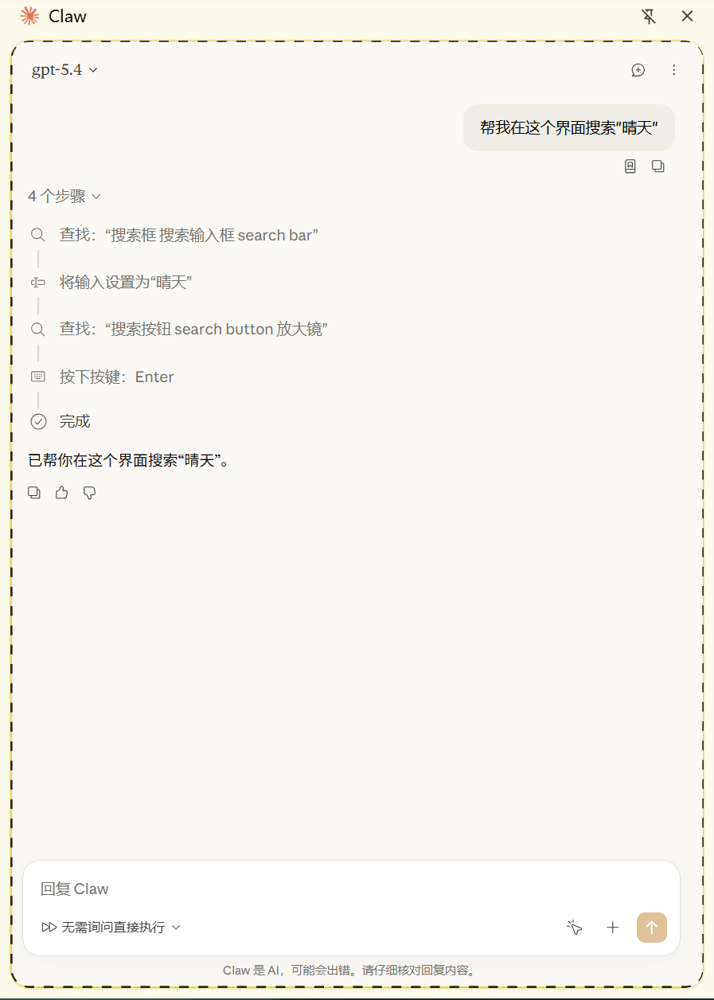
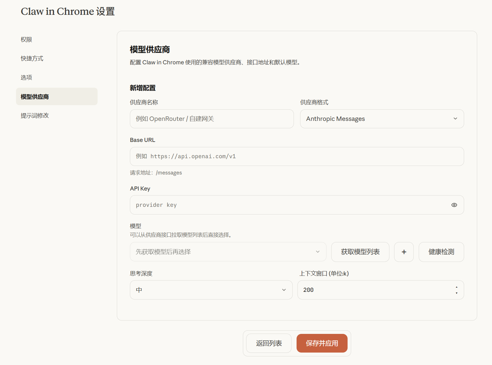

#  Claw in Chrome

<div align="center">


</div>

简体中文 | [English](./README_EN.md)

这是一个放在 Chrome 侧边栏里的助手扩展。解除了Claude in Chrome的登录限制和套餐限制,支持自定义模型供应商,并且支持编辑原插件不支持编辑的参数,让您的大模型在该插件中有更好的表现!

## 简介

这个扩展主要功能：

- 支持接入你自己的模型接口
- 在侧边栏让ai操控你的浏览器帮你完成任务



## 1. 安装

1. 打开 `chrome://extensions/`
2. 开启右上角“开发者模式”
3. 点击“加载已解压的扩展程序”
4. 选择当前这个 `claw in chrome` 文件夹
5. 把 `Claw` 固定到浏览器工具栏

## 2. 配置

先打开扩展设置页，然后进入左侧的 `模型供应商`。

新增一套配置后，主要填写这几项：

- `供应商格式`
- `Base URL`
- `API Key`
- `模型` 


填完后点击 `保存并应用`，然后把侧边栏关掉再重新打开一次,之后就可以愉快使用啦~ 
## 3. 推荐设置

**推荐将“供应商格式”设置为 `Anthropic` 协议**。相比于其他协议格式，使用 Anthropic 协议进行调用能够最大程度发挥工具的潜力，模型在实际使用中的表现和响应效果会更好。



## 4. 测试

首次执行：

```bash
npm install
```

常用命令：

```bash
npm run test:unit
npm run test:integration
npm run test:e2e
npm test
```

说明：

- `test:unit` 只跑纯逻辑回归
- `test:integration` 跑 fake `chrome` 环境集成测试
- `test:e2e` 默认启动 Playwright 自带 Chromium，加载当前扩展目录做冒烟验证
- `npm test` 会按 `unit -> integration -> e2e` 全量执行

如果你想强制使用本机 Chrome/Edge，也可以先设置环境变量 `CLAW_E2E_BROWSER_PATH`


## Star 历史

<a href="https://www.star-history.com/?repos=S-Trespassing%2Fclaw-in-chrome&type=date&legend=top-left">
 <picture>
   <source media="(prefers-color-scheme: dark)" srcset="https://api.star-history.com/chart?repos=S-Trespassing/claw-in-chrome&type=date&theme=dark&legend=top-left" />
   <source media="(prefers-color-scheme: light)" srcset="https://api.star-history.com/chart?repos=S-Trespassing/claw-in-chrome&type=date&legend=top-left" />
   
 </picture>
</a>
