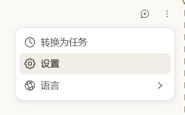
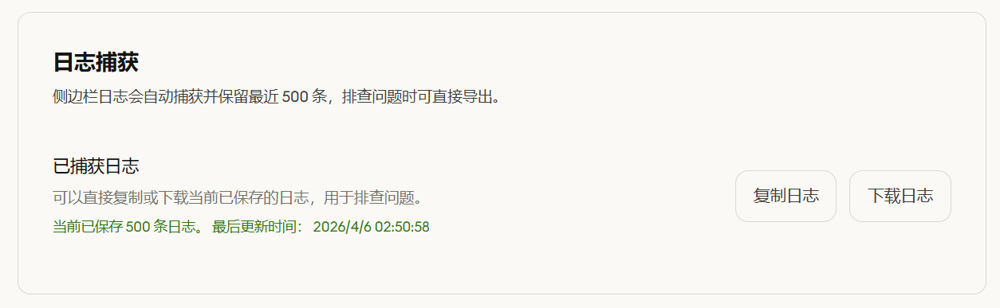

#  Claw in Chrome

<div align="center">


</div>

[简体中文](./README.md) | English

## User Guide

> This is the English companion guide for ordinary users. The complete folder you should upload and distribute is this `claw in chrome` directory. The bundled `manifest.json` version is `1.0.66`, and Chrome `116+` is recommended.

## 1. What This Extension Does

Claw in Chrome is a browser assistant that runs inside the Chrome side panel. You can use it to:

- chat in the side panel
- connect a custom model provider
- choose between `OpenAI Chat Completions` and `OpenAI Responses API`
- adjust `Reasoning effort`
- export side panel logs for troubleshooting

This repository uses Chinese as the default documentation language. If you are helping a Chinese user, go back to the main guide: [README.md](./README.md).

## 2. Installation

### 2.1 Before You Start

Please make sure:

- you are using Chrome `116+` or a Chromium browser that supports Chrome extensions
- the folder you will load and upload is this `claw in chrome` directory
- you already have a valid `Base URL`, `API Key`, and default model name for your provider

### 2.2 Load the Unpacked Extension

1. Open `chrome://extensions/`
2. Turn on **Developer mode**
3. Click **Load unpacked**
4. Select this `claw in chrome` folder
5. Confirm that a `Claw` extension card appears

### 2.3 Pin the Extension and Keep the Entry Visible

After loading the extension, pin it to the toolbar first.

1. Click the extensions puzzle icon in the top-right corner of Chrome
2. Find `Claw`
3. Click the pin icon
4. After that, you can open it directly from the toolbar
5. You can also try the shortcut `Ctrl+E`

## 3. First Launch and Basic Setup

### 3.1 Open the Options Page

Before using the side panel, configure the provider first.

You can open the options page in either way:

1. Go to `chrome://extensions/`
2. Find `Claw`
3. Open **Details**
4. Open the extension options page

Or:

1. Right-click the `Claw` icon in the toolbar
2. Open the options page

According to the current build, the options page includes these important sidebar entries:

- `模型供应商` (Provider profiles)
- `提示词修改` (Prompt profiles)
- `日志捕获` (Captured logs)



The image above should ideally show the left sidebar and the `模型供应商`, `提示词修改`, and `日志捕获` entries.

### 3.2 Three Rules to Remember

Before you continue, keep these three points in mind:

1. Always click `保存并应用` after editing a provider
2. After saving, close and reopen the side panel
3. If requests fail, check whether `供应商格式` is set correctly

## 4. Custom Provider Setup

This is the most important part. Once configured, the side panel will send requests through your custom provider.

### 4.1 Create a Provider Profile

1. Open `模型供应商`
2. Click `新增配置`
3. Turn on `启用自定义供应商`
4. Fill in the fields described below

### 4.2 What Each Field Means

- `供应商名称` (Provider name)
  - Use any name you can recognize easily
  - Examples: `OpenAI Official`, `OpenRouter`, `My Gateway`
- `供应商格式` (Provider format)
  - Choose `OpenAI Chat Completions` if your endpoint is compatible with `/chat/completions`
  - Choose `OpenAI Responses API` if your endpoint is compatible with `/responses`
  - If you choose the wrong format, the request URL will be wrong and requests may fail
- `Base URL`
  - Enter the root endpoint only
  - Example: `https://api.openai.com/v1`
  - The extension will append `/chat/completions` or `/responses` automatically
- `API Key`
  - Enter your provider key
- `模型` (Model)
  - You can type it manually, such as `gpt-5.4`
  - Or click `获取模型列表` first and choose from the list
- `思考深度` (Reasoning effort)
  - This only applies to providers and models that support reasoning effort
  - If you are unsure, start with `中`
  - If your provider does not support it, set it to `关闭`
- `上下文窗口 (单位:k)` (Context window)
  - This field is entered in `k`
  - For example, `200` usually means about `200k`
  - The current code uses `200` as the default
- `健康检测` (Health check)
  - It is a good idea to run this before saving
  - A successful `Reply with OK only.` response usually means the chain is working

### 4.3 Recommended Order

Use this order for the smoothest setup:

1. Fill `供应商名称`
2. Choose `供应商格式`
3. Fill `Base URL`
4. Fill `API Key`
5. Click `获取模型列表`
6. Choose `模型`, or type a model ID manually
7. Choose `思考深度`
8. Keep `上下文窗口 (单位:k)` as `200` unless you know you need another value
9. Run `健康检测`
10. Click `保存并应用`
11. Close and reopen the side panel


The image above should ideally show the `模型供应商` page with `供应商格式`, `Base URL`, `API Key`, `思考深度`, `上下文窗口 (单位:k)`, and `保存并应用`.

## 5. Using the Side Panel

### 5.1 Open the Side Panel

After the provider is configured, you can start using Claw in Chrome normally.

Common ways to open it:

1. Click the `Claw` icon in the toolbar
2. Or use the shortcut `Ctrl+E`

If you changed the provider just now but still see the old state, close the side panel completely and reopen it.

### 5.2 Run a Minimal Test First

For the first check, send the simplest possible test message:

```text
Hello, please reply with OK only.
```

If you get a normal reply, your provider connection is working.

### 5.3 How to Handle Permission Prompts

When Claw wants to read the page, click elements, or perform browser actions, you may see permission prompts. Common options include:

- `允许一次`
- `按照计划执行`
- `对所有聊天允许`

For normal users, this is the safest approach:

- start with `允许一次`
- use `按照计划执行` only after you trust the website and the task
- use `对所有聊天允许` only when you fully understand the risk


The image above should ideally show the side panel in a working state, including the chat input box and part of the conversation.

## 6. Log Capture and Troubleshooting

### 6.1 How to Export Logs

If you see a blank panel, a script error, no response, or provider failures, export logs first.

Steps:

1. Open `日志捕获`
2. Turn on `启用调试模式`
3. Go back and reproduce the issue once
4. Return to `日志捕获`
5. Use `复制日志` or `下载日志`

The current build keeps the latest `500` side panel log entries, which is enough for most common troubleshooting cases.



The image above should ideally show `启用调试模式`, `复制日志`, `下载日志`, and the current captured log count.

### 6.2 Known Issue 1: `Identifier 'TX' has already been declared`

Your current workspace log file `1.log` already contains this error:

```text
Uncaught SyntaxError: Identifier 'TX' has already been declared
```

This kind of issue usually looks like this:

- the side panel opens but stays blank
- the page loads, but the panel does not respond correctly
- `window.error` appears in exported logs

Try this order first:

1. Go back to `chrome://extensions/`
2. Click **Reload** on the `Claw` extension card
3. Close every open Claw side panel
4. Refresh the target page
5. Open the side panel again
6. If it still reproduces, export fresh logs and continue troubleshooting

### 6.3 Known Issue 2: Wrong Provider Format

If `供应商格式` is wrong, you may see:

- health check failures
- no reply from the model
- an incorrect request preview
- `404`, `400`, or format-related API errors

Quick checks:

- choose `OpenAI Chat Completions` for `/chat/completions`
- choose `OpenAI Responses API` for `/responses`
- check the request preview on the options page to confirm the final endpoint

### 6.4 Known Issue 3: Changes Do Not Apply

If you already changed the provider but the side panel still behaves as if nothing changed, the usual reasons are:

- you did not click `保存并应用`
- you did not reopen the side panel after saving

The safest fix is:

1. Open `模型供应商` again
2. Confirm the current profile is correct
3. Click `保存并应用` again
4. Close and reopen the side panel

## 7. FAQ

### 7.1 Which Folder Should I Load?

Load `claw in chrome`. This is also the only folder you need to upload for sharing.

### 7.2 Do I Have To Fill `上下文窗口 (单位:k)`?

Not necessarily. For most ordinary users, keeping the default value `200` is fine.

### 7.3 How Should I Choose `思考深度`?

If you are unsure:

- start with `中`
- switch to `关闭` if your provider does not support reasoning effort

### 7.4 Where Is the Chinese Version?

Open the Chinese main guide here: [README.md](./README.md)

### 7.5 Where Should the Screenshots Go?

The easiest shared location is:

```text
docs/screenshots/
```

Put the screenshots into `docs/screenshots/` and use these file names:

```text
01.png
02.png
03.png
04.png
```

##  Star 历史

## Star History

[](https://www.star-history.com/#S-Trespassing/--&type=date&legend=top-left)
